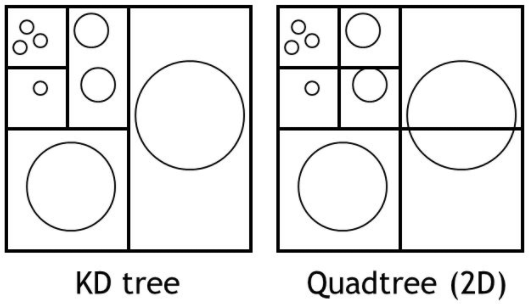

  

# Multidimentional Data Structures

This repository holds the implementation of the KDTree and the QuadTree, multidimentional data structures, written in the Python programming language. This was created during an elective course, called Multidimentional Data Structures, completed during my third year of studies in the Computer Engineering and Informatics Department at the University of Patras. 

# Structure

In the KD-Tree folder you can find the code for the kd tree, the data and the airports class that represents each airport. The same can be found in the Quad-Tree folder, with the main difference, that the code is for a quad tree.

